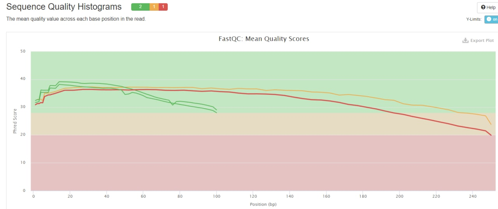
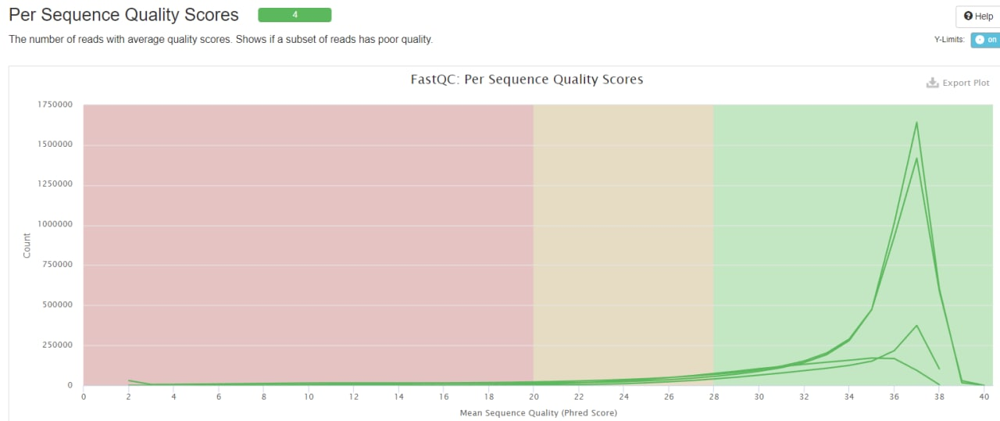
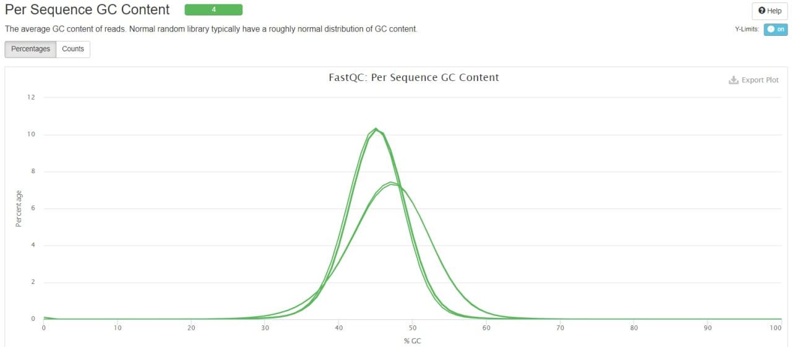
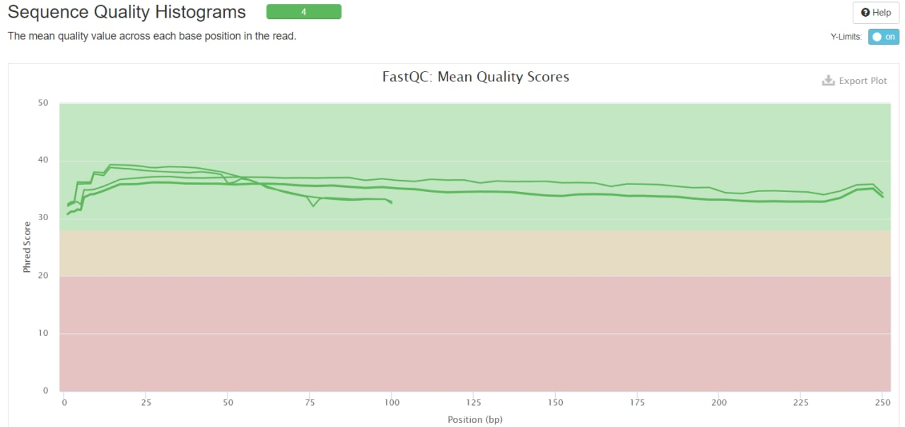
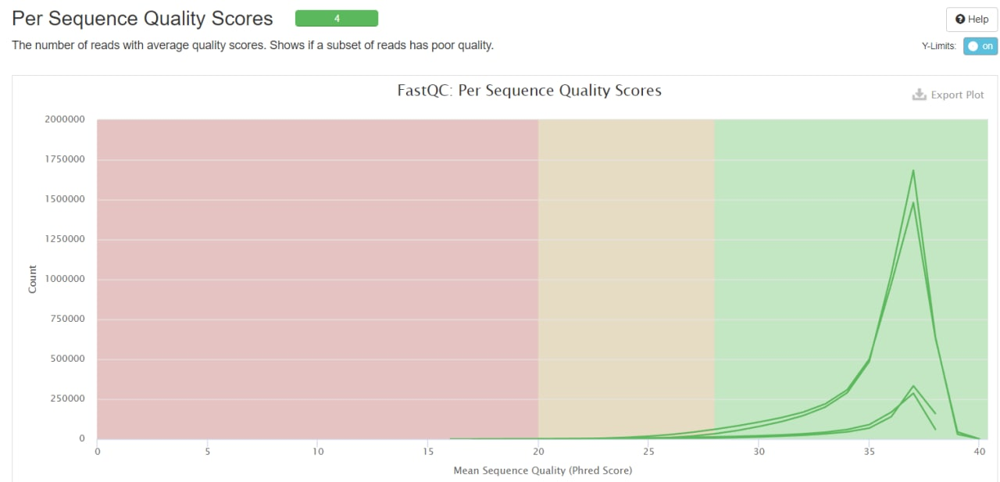
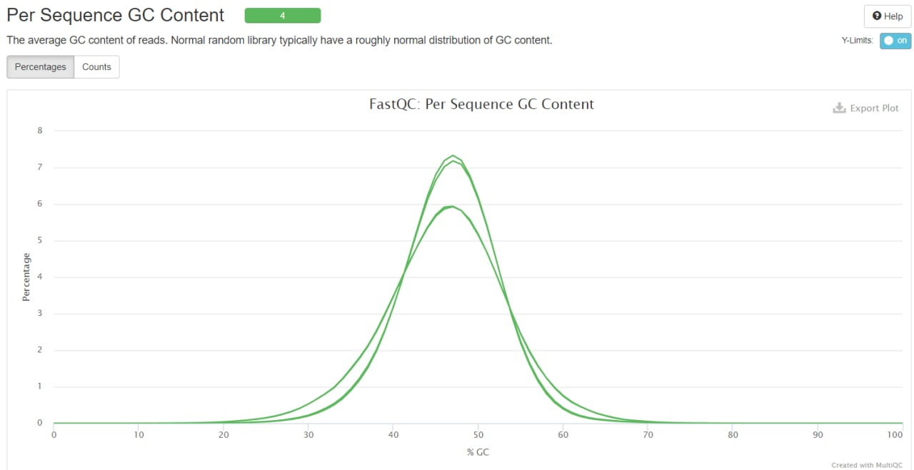
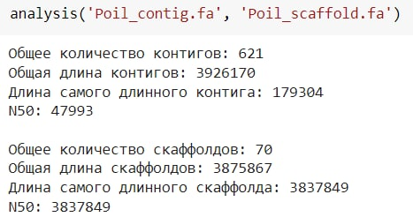
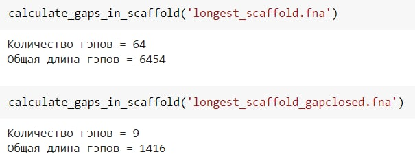
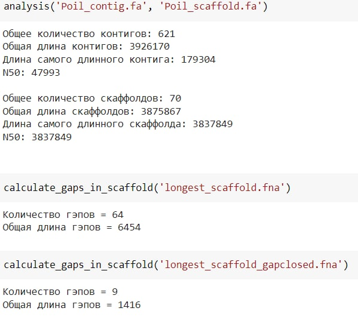

#### 1. Создаем папку с ДЗ и добавляем ссылку на папку с сырыми данными:  
```
ln -s /usr/share/data-minor-bioinf/assembly/  
mkdir hw1  
mv assembly/ hw1/assembly/  
cd hw1/  
```
#### 2. Делаем случайные чтения:  
```
seqtk sample -s1119 assembly/oil_R1.fastq 5000000 > R1_pe.fastq  
seqtk sample -s1119 assembly/oil_R2.fastq 5000000 > R2_pe.fastq  
seqtk sample -s1119 assembly/oilMP_S4_L001_R1_001.fastq 1500000 > R1_mp.fastq  
seqtk sample -s1119 assembly/oilMP_S4_L001_R2_001.fastq 1500000 > R2_mp.fastq 
``` 
#### 3. Оцениваем качество этих чтений (fastQC и multiQC):  
```
mkdir fastqc
ls *.fastq | xargs -P 4 -tI{} fastqc -o fastqc {}>scaffold1_len3837849_cov231

mkdir multiqc
multiqc -o multiqc fastqc
```
#### 4. С помощью программ platanus_trim и platanus_internal_trim подрезаем чтения по качеству и удаляем праймеры:
```
platanus_trim R1_pe.fastq R2_pe.fastq
platanus_internal_trim R1_mp.fastq R2_mp.fastq
```
#### 5. Удаляем исходные .fastq файлы:
```
rm *.fastq
```
#### 6. С помощью программы fastQC и multiQC оцениваем качество подрезанных чтений и получаем по ним общую статистику:
```
mkdir trimmed_fastq
mv -v *trimmed trimmed_fastq/

mkdir trimmed_fastqc
ls trimmed_fastq/* | xargs -P 4 -tI{} fastqc -o trimmed_fastqc {}

mkdir trimmed_multiqc
multiqc -o trimmed_multiqc trimmed_fastqc
```

ДО:






ПОСЛЕ:






#### 7. Cобираем контиги из подрезанных чтений:
```
time platanus assemble -o Poil -f trimmed_fastq/R1_pe.fastq.trimmed trimmed_fastq/R2_pe.fastq.trimmed 2> assemble.log &
```
#### 8. Собираем скаффолды:
```
time platanus scaffold -o Poil -c Poil_contig.fa -IP1 trimmed_fastq/R1_pe.fastq.trimmed trimmed_fastq/R2_pe.fastq.trimmed -OP2 trimmed_fastq/R1_mp.fastq.int_trimmed trimmed_fastq/R2_mp.fastq.int_trimmed 2> scaffold.log &
```
#### 9. Анализируем полученные контиги и скаффолды:

#### 10. Создаем файл с самым длинным скаффолдом:
```
echo scaffold1_len3837849_cov231 > name_scaffold.txt
seqtk subseq Poil_scaffold.fa name_scaffold.txt > longest_scaffold.fna
```
#### 12. Собираем скаффолды с меньшим количеством пропусков:
```
time platanus gap_close -o Poil -c Poil_scaffold.fa -IP1 trimmed_fastq/R1_pe.fastq.trimmed  trimmed_fastq/R2_pe.fastq.trimmed -OP2 trimmed_fastq/R1_mp.fastq.int_trimmed trimmed_fastq/R2_mp.fastq.int_trimmed 2> gapclose.log &
```
#### 13. Создаем файл с самым длинным скаффолдом с меньшим количеством пропусков:
```
echo scaffold1_cov231 > longest_scaffold_gapclosed.txt
seqtk subseq Poil_gapClosed.fa longest_scaffold_gapclosed.txt > longest_scaffold_gapclosed.fna
```
#### 14. Сравним полученные данные о гэпах в самом большом скаффолде до и после использования platanus gap_close

#### 15. Повторяем все действия для меньшего количества чтений (5 млн → 1 млн, 1.5 млн → 300 тыс.)

